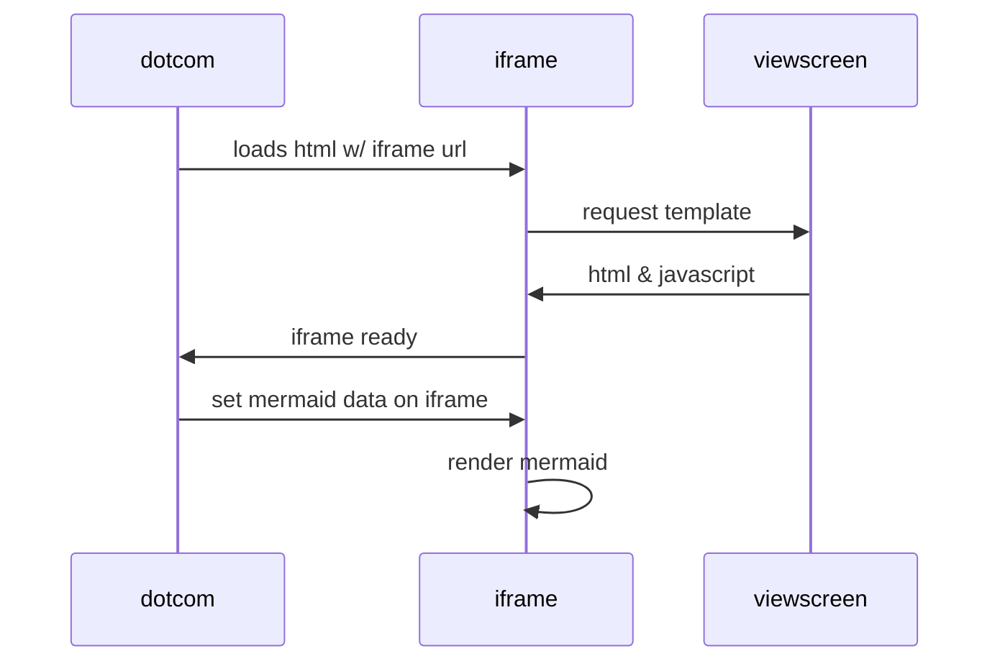

## Test Diagram

@startuml

skin rose
left to right direction
title Банкомат
actor клиент
actor Банк
rectangle Банкомат {
клиент -- (Снатие наличных)
клиент -- (Проверка баланса)
клиент -- (Пулучение кредита)
 (Снатие наличных) .> (Проверка баланса) : include
  (Пулучение кредита) .> (Проверка баланса) : extend
Банк -- (Проверка работоспособности)
}
@enduml